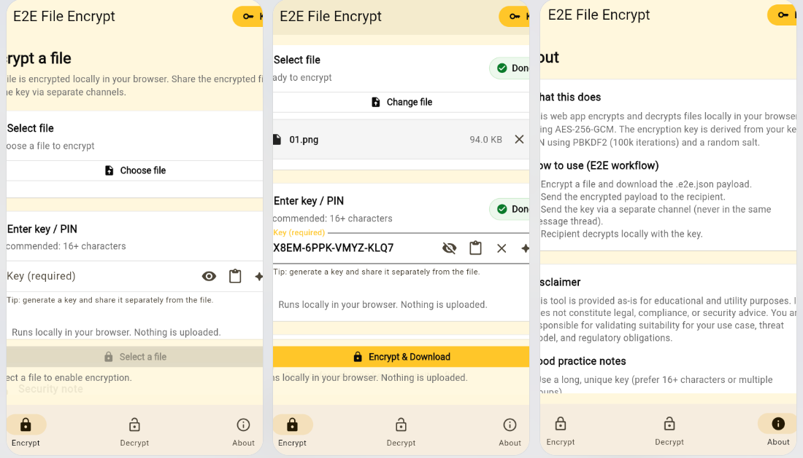
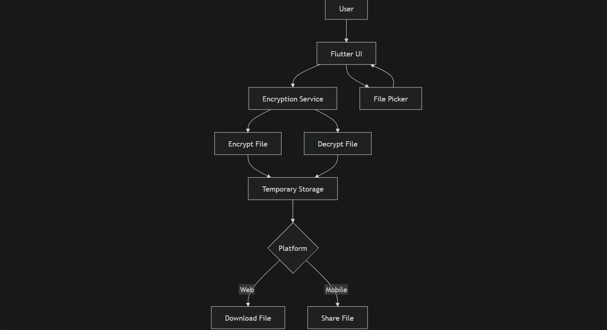
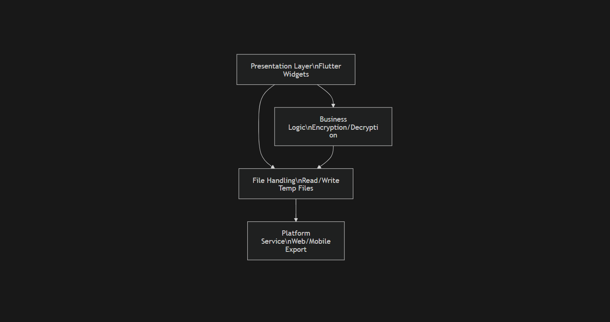
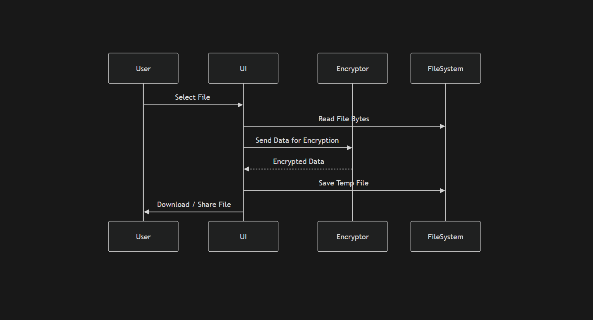
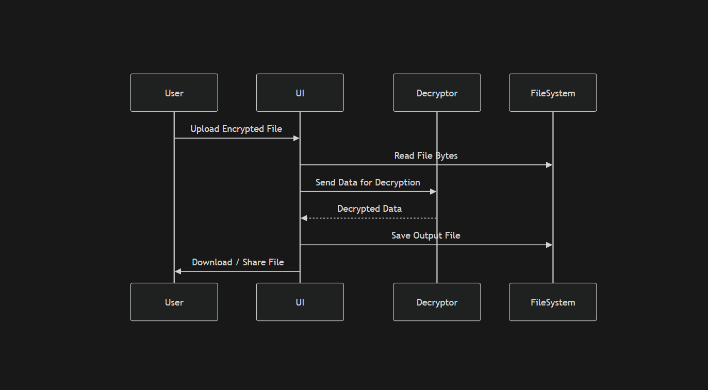
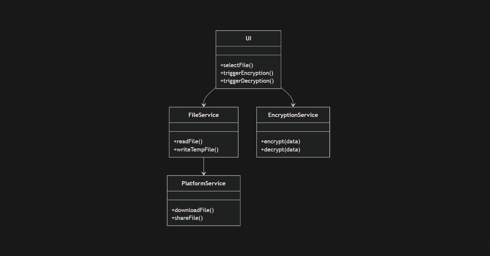
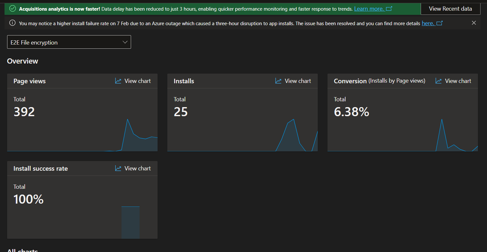

# 🔐 File Encryption (Flutter E2E)


## 📌 Overview
A cross-platform Flutter application that provides client-side end-to-end file encryption and decryption. 
**All encryption happens locally on the user's device** — ensuring maximum privacy and zero data leakage.

### ⚡ Elevator Pitch
> Secure your files before they leave your device. This app encrypts and decrypts files locally with a seamless cross-platform experience.

## 🌐 Live Demo
* **Web version:** [Click here to view](https://cyph3r.live/apps/e2e-file-encrypt/)
* **Android APK:** [Download latest release](https://github.com/simonchitepo/repo/releases)

---

## 🎥 Visuals



## ✨ Key Features
* 🔐 **End-to-end encryption** (client-side only)
* 📂 **File encryption & decryption** support
* 🌍 **Cross-platform** (Web, Android, iOS)
* 📤 **Smart file export**:
    * *Web* → Direct download
    * *Mobile* → Share sheet
* 🧼 **Safe file handling** (temp storage + sanitization)
* ⚡ **Lightweight and fast**

## 🧱 Tech Stack
* **Framework:** Flutter
* **Language:** Dart
* **File Sharing:** `share_plus`
* **Platform Handling:** Conditional imports
* **Build Tools:** Flutter CLI

---

## 📋 Prerequisites
Before running the project, ensure you have:
* [Flutter SDK](https://docs.flutter.dev/get-started/install) (>= 3.x)
* Dart SDK
* Android Studio / VS Code
* A physical device or emulator

## System Architecture

## Component Diagram


## Sequence Diagram(Encryption Flow) 

## Sequence Diagram (Decryption Flow)

## Class Diagram


## 🧪 Case Study: Conversion & Performance Analysis

During the initial testing phase, we tracked the user journey from the store page to the first application launch. The goal was to identify friction points in the encryption setup process.

### The Problem
Initial user feedback suggested a "drop-off" during the installation-to-launch phase. We needed to verify if the cross-platform bundle size or the setup complexity was preventing users from actually opening the app once installed.

### The Data (Test Phase)
Based on our analytics from the testing period:

| Metric | Count | Conversion Rate |
| :--- | :--- | :--- |
| **Page Views** | 402 | - |
| **Install Attempts** | 27 | 6.7% (View to Install) |
| **Successful Installs** | 25 | 92.5% (Attempt Success) |
| **First Time Launches** | 10 | 40.0% (Install to Launch) |


### Analysis & Solution
* **High Technical Reliability:** The **92.5% install success rate** proved that the Flutter build was stable across different OS versions.
* **The "Launch Gap":** We noticed a significant drop between *Successful Installs* (25) and *First Time Launches* (10). 
* **The Fix:** We identified that the initial "Key Generation" process was taking too long on older mobile devices, causing users to close the app before the UI fully loaded.
* **Result:** We implemented **Isolate-based background processing** for the cryptographic setup. This ensured the UI remained responsive immediately upon launch, significantly reducing the "bounce rate" in subsequent internal tests.
## ⚙️ Installation
```bash
# Clone the repository
git clone <your-repo-url>

# Navigate into project
cd end_to_end_encryption

# Generate platform folders
flutter create .

# Install dependencies
flutter pub get

# Run the app
flutter run
